# prettyRedis
- prettyRedis是一款简约而不简单的redis客户端UI。
1. 跨平台，支持windows,linux,mac.
2. 同时支持单机，哨兵，集群模式.
3. 相当实用的Terminal。
4. key用树形展示，支持分组，支持百万key的渲染而无卡顿。
5. 可根据自自己需要自定义配置。
6. 对集群做了一些比较实用的优化。

## 简约而不简单的Terminal
1. 支持多tab切换，同一tab可以在不同环境随意切换。
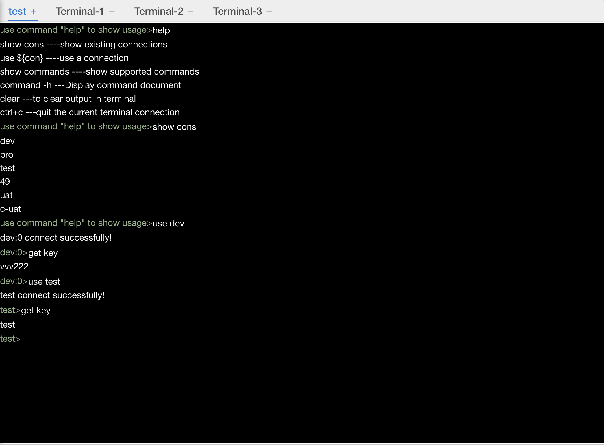
2. 重写了keys命令，用scan+pipeline技术实现，新增自定义命令keysv,即在keys的基础上查出查出的key的value,用json展现结果，可以支持copy出去，相当于导出功能，同时也支持集群模式。
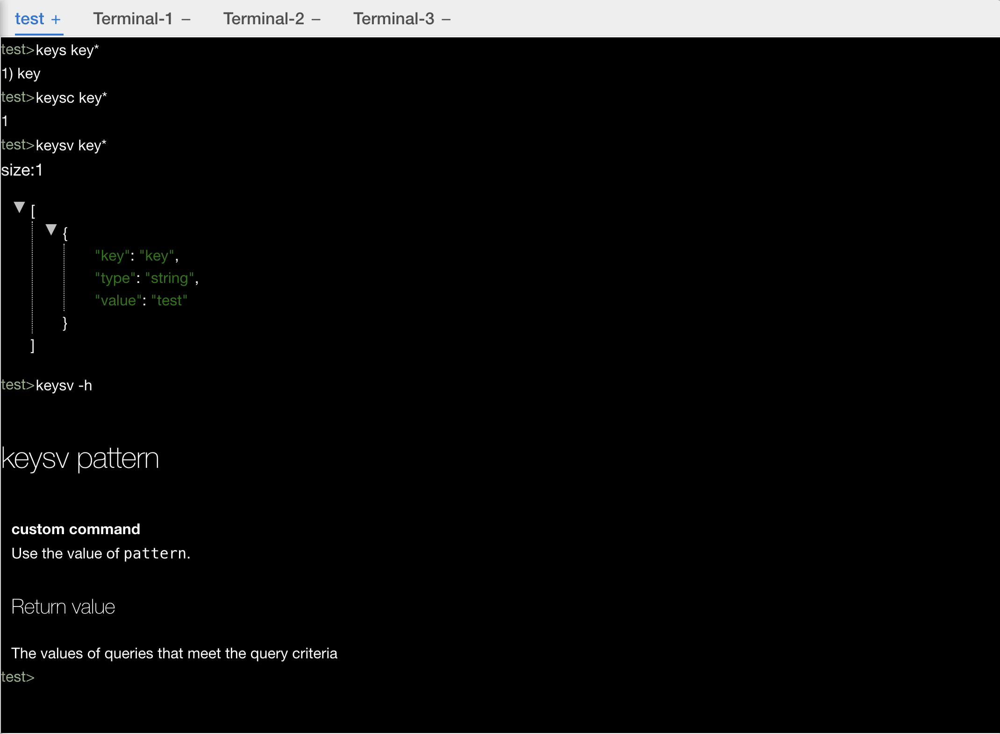
3. 命令文档查询
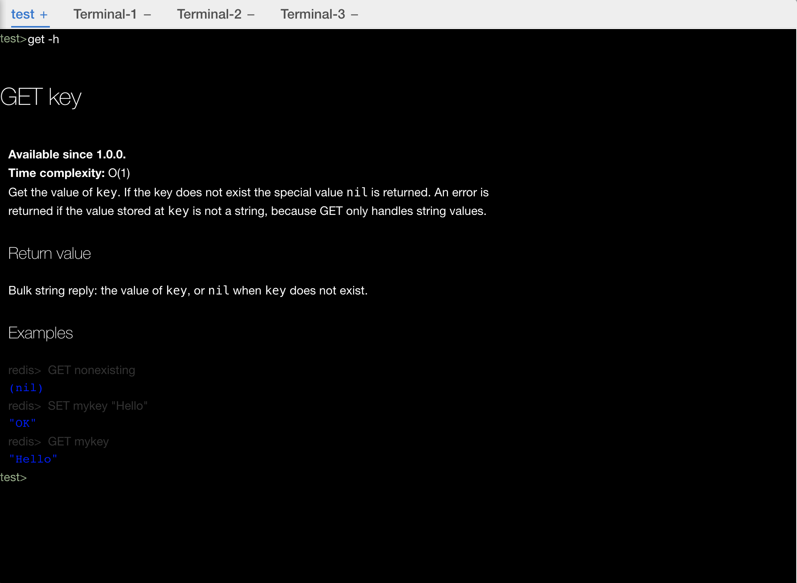
4. 关键字查询
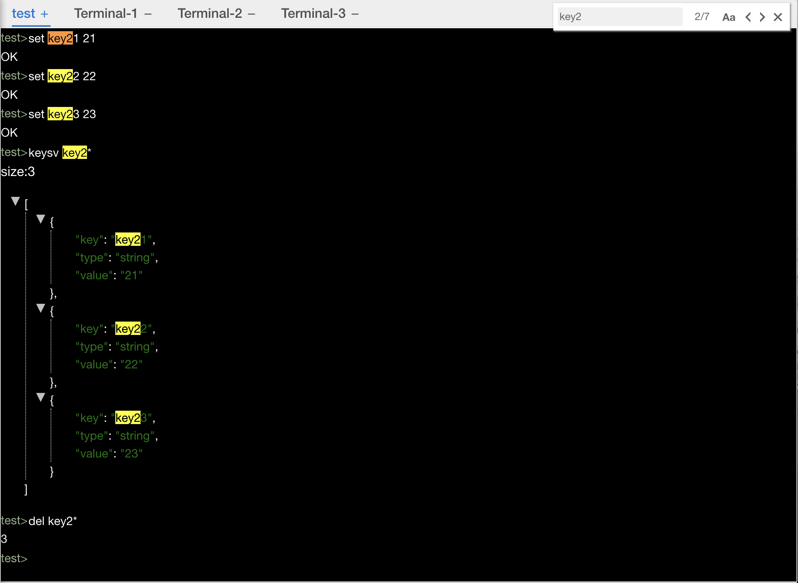
5. 命令tab自动补全，同时支持命令参数提示
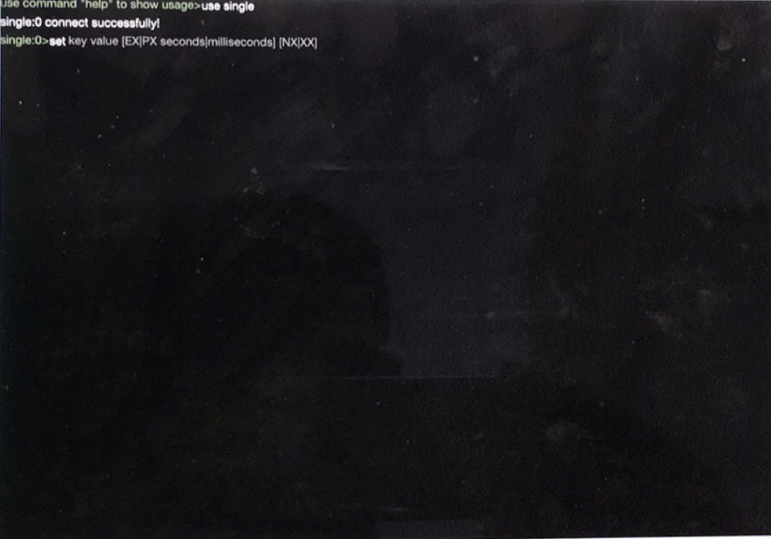
6. 重写了del命令，除了支持原生指定多个key删除外，还扩展了根据pattern模糊匹配删除。同时也支持集群。
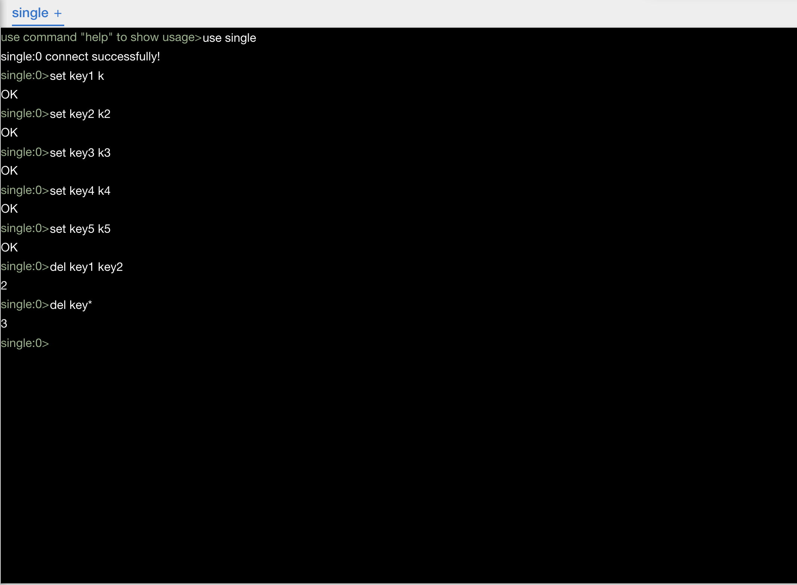

## 简约而不简单的UI view

1. 支持多环境展示，同时用不同图标标识出是单机，哨兵还是集群
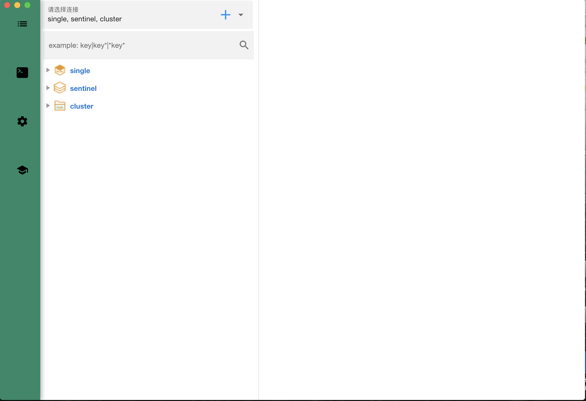
2. 支持百万key加载无卡吨
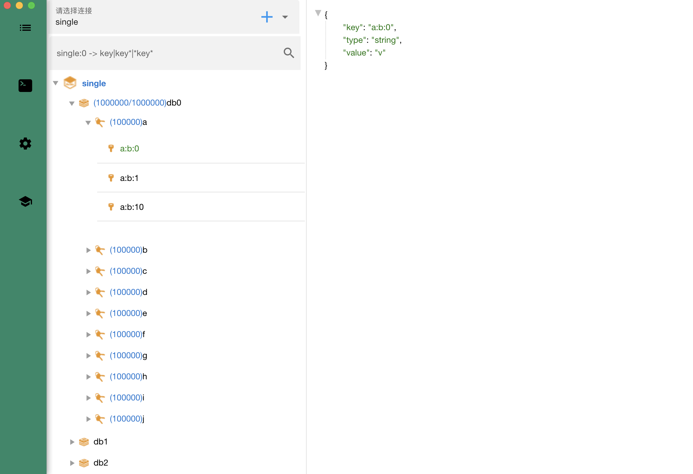
3. 方便的查询，输入查询条件直接enter，自动识别出需要查寻的连接。(即最后操作的节点)
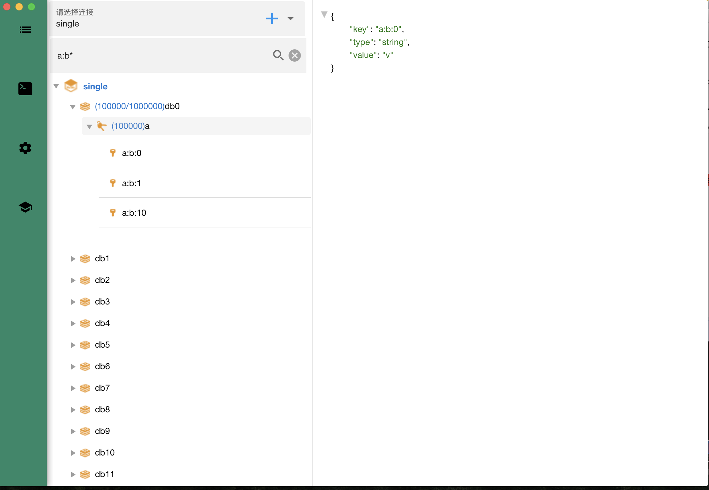
4. 数据量少时可以分组展示，在多少时用分组都是配置的，可根据需要改之。
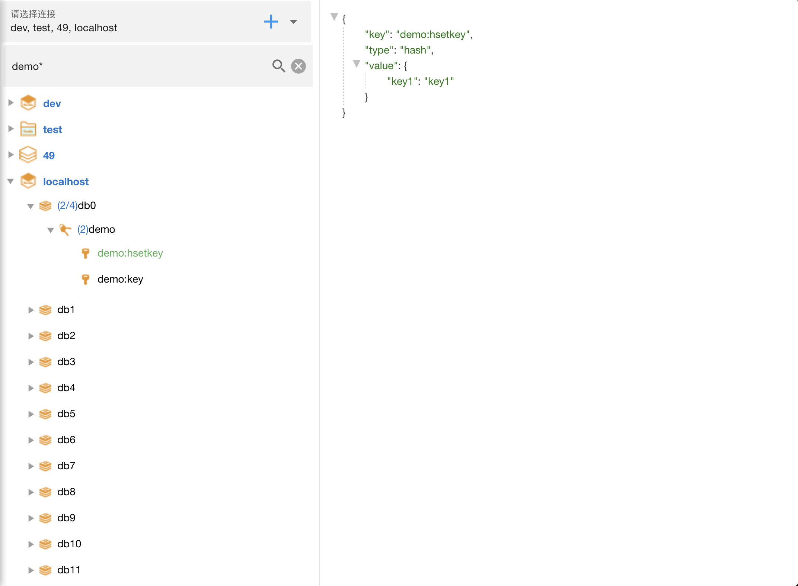
5. 可配置项目
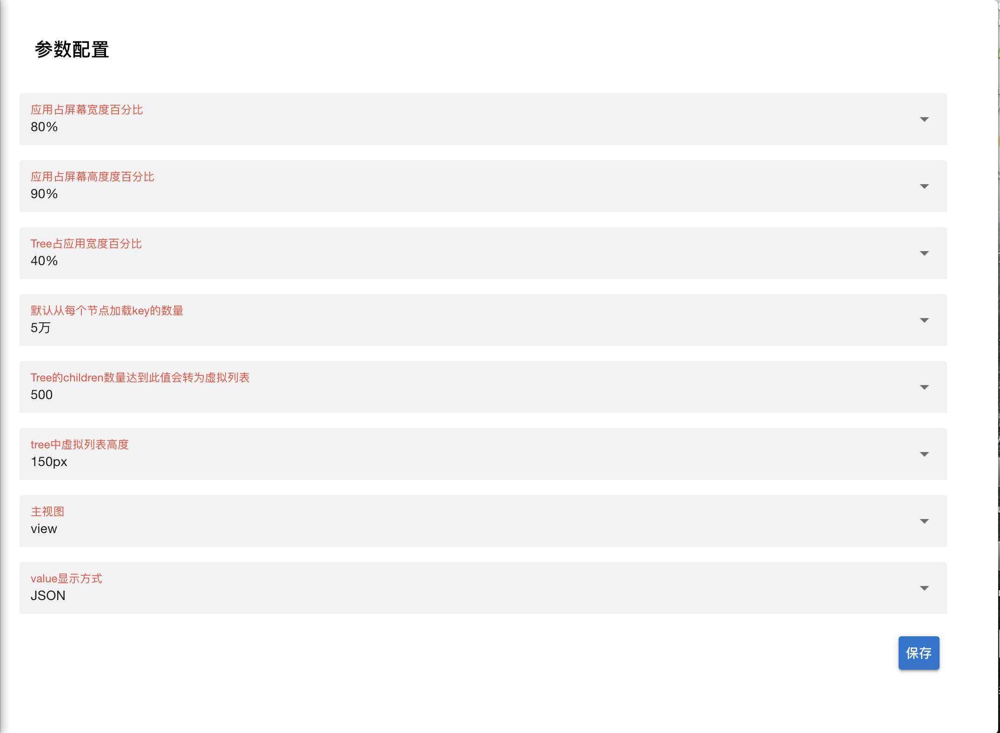
